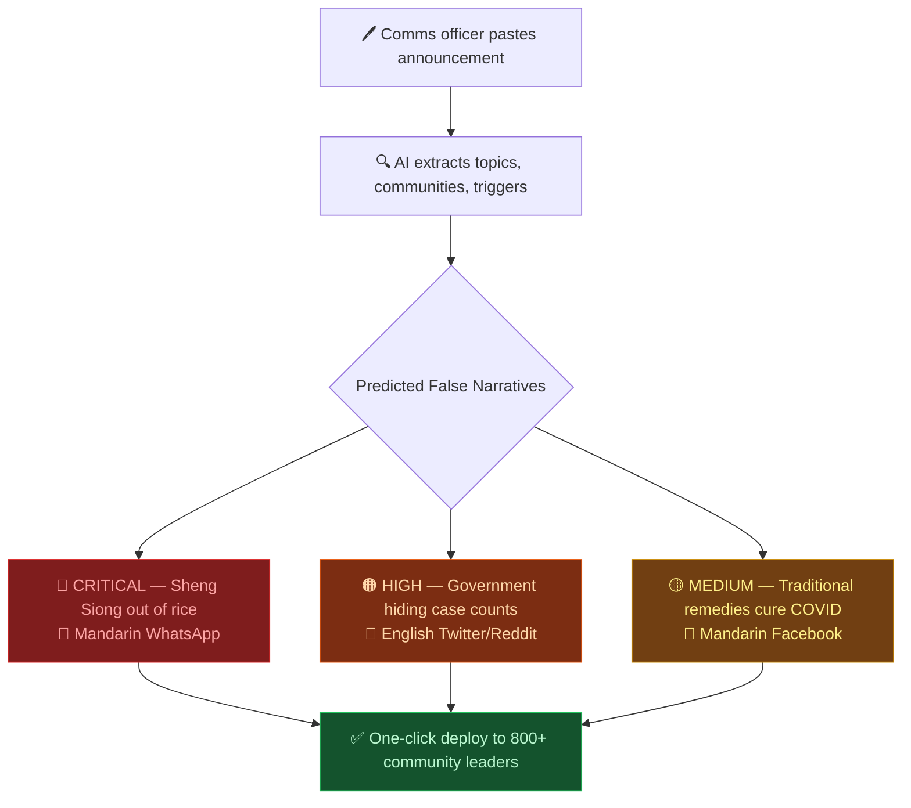

# ContextGuard

    
  </a>
   
  <em>🏆 <a href="https://hackomania.geekshacking.com/" target="_blank">HackOMania Winner</a> ahrefs— ContextGuard</em>

### AI-Powered Rumour Pre-Mortem Engine for Singapore

> **HackOMania Problem Statement:** How might we design AI-powered solutions that help local and multilingual communities in Singapore assess information credibility, understand context, and make informed decisions — especially during times of uncertainty?

  

---

## The Problem

Every existing solution — POFMA, CNA fact-checks, chatbots — is **reactive**. They correct misinformation *after* it has already spread.

> In February 2020, a rumour spread across WhatsApp that Sheng Siong had run out of rice. Within 6 hours, queues wrapped around every supermarket in Singapore. MOH issued a correction at 11pm — **8 hours too late**. 300,000 people had already panic-bought.

This pattern repeats every crisis: announcement → information vacuum → misinformation rushes in (in Mandarin, Malay, Tamil, via voice notes and dialects) → correction arrives too late → damage is done.

## Our Solution

ContextGuard is **proactive**. It predicts what misinformation will emerge *before* it spreads, and arms trusted community leaders with pre-written counter-narratives in all 4 official languages.

  

---

## Why Singapore Misinformation Is Predictable

Singapore's misinformation follows patterns:
- The same **emotional triggers** (financial anxiety, racial tension, health fear)
- The same **language communities** targeted
- The same **gap** between official communication and public fear

We have a decade of POFMA notices, MOH corrections, and CNA fact-checks that prove this. The patterns are there — nobody has turned them into predictions. Until now.

---

## Tech Stack

| Layer | Technology | Purpose |
|-------|-----------|---------|
| **Frontend** | Next.js 16 (App Router) + React 19 | SSR, routing, API routes |
| **Styling** | Tailwind CSS 4 | Responsive dark-themed UI |
| **Language** | TypeScript 5 | End-to-end type safety |
| **LLM** | Google Gemini 2.5 Flash | Topic extraction, rumour prediction, counter-narrative generation |
| **Embeddings** | Gemini `embedding-001` | 768-dimensional text vectors for RAG |
| **Vector DB / RAG** | ClickHouse (MergeTree) | Hybrid topic + vector search over historical articles |
| **Web Scraping** | Firecrawl | Live source retrieval from POFMA, CNA, MOH |
| **Messaging** | Telegram Bot API | One-click counter-narrative deployment to community leaders |
| **PDF Support** | pdfjs-dist + react-pdf | Upload and parse PDF announcements |
| **Package Manager** | Bun | Fast dependency management |
| **Hosting** | Vercel | Serverless deployment |

