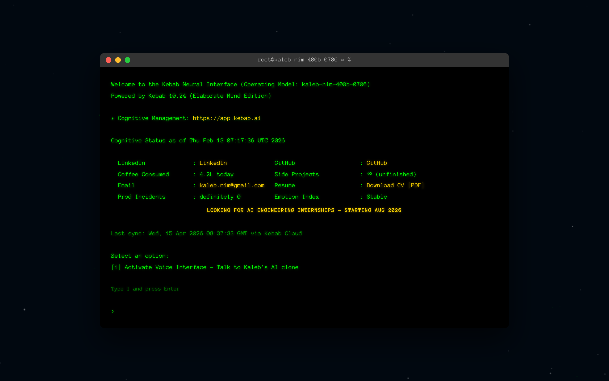
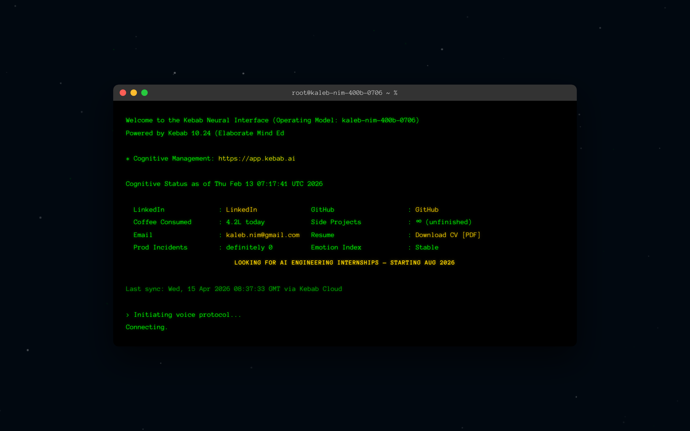
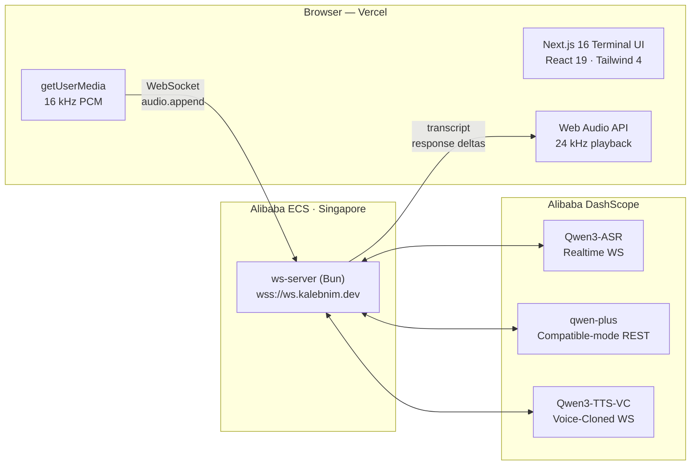
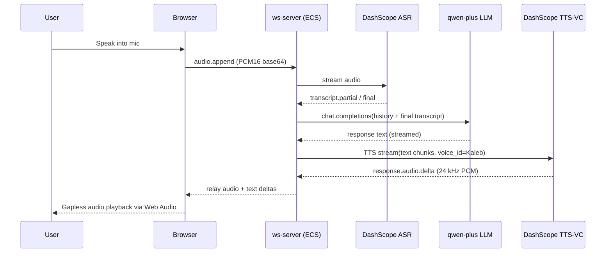
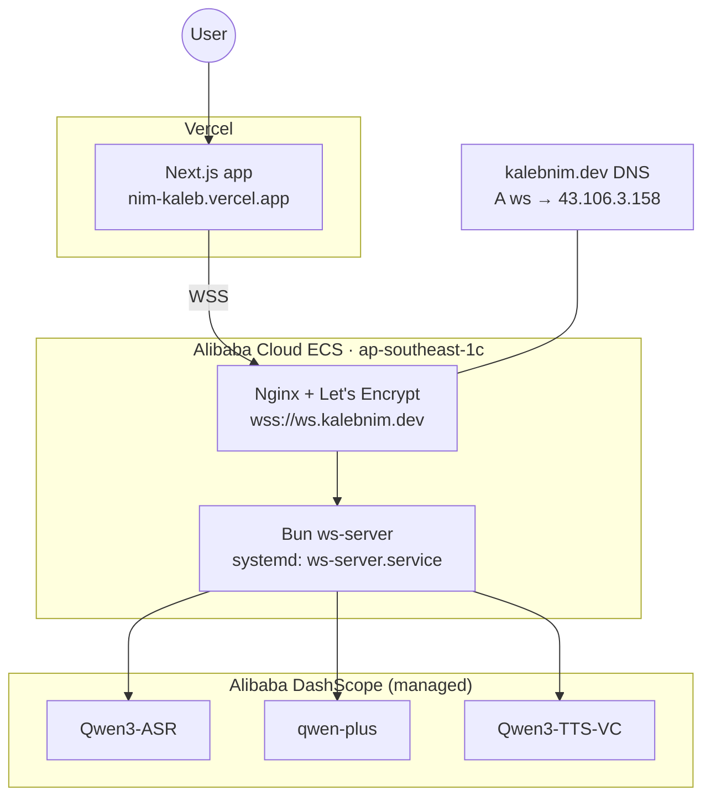

# nim-kaleb

> **Welcome to my AI voice portfolio.** Instead of reading a static résumé, visitors talk to an AI clone that answers in my own  cloned voice — about his experience, projects, and goals.

**Live:** https://nim-kaleb.vercel.app

---

## What it is

A sci-fi terminal UI ("Kebab Neural Interface") renders over an animated starfield. The visitor types `1` to activate the voice interface, which opens a real-time voice session with an AI clone of Kaleb.

The voice pipeline runs end-to-end on **Alibaba DashScope**:

- **ASR** — `qwen3-asr-flash-realtime` (streaming speech-to-text)
- **LLM** — `qwen-plus` (conversational reasoning with Kaleb's biography as system prompt)
- **TTS** — `qwen3-tts-vc-realtime` (streaming text-to-speech with Kaleb's **voice clone**)

The conversation feels like talking to Kaleb, not a chatbot: his cadence, his filler words, his voice.

---

## Architecture

---

## Voice call flow

---

## Deployment topology

---

## Services

| Directory      | Runtime        | Role                                                                                     |
| -------------- | -------------- | ---------------------------------------------------------------------------------------- |
| `app/`         | Next.js 16     | Terminal UI, starfield, state machine, voice WebSocket client                            |
| `ws-server/`   | Bun / TS       | Session orchestrator on ECS — fans out to DashScope ASR / LLM / TTS and relays to client |
| `tts-server/`  | Python FastAPI | Local Qwen3-TTS fallback server (dev-only, not in the prod pipeline)                     |

---

## Tech stack

- **Frontend:** Next.js 16 (App Router) · React 19.2 · TypeScript 5 · Tailwind CSS 4 · Anonymous Pro (Google Fonts)
- **Edge server:** Bun · WebSocket streaming · Nginx + Let's Encrypt
- **AI pipeline:** Alibaba DashScope — Qwen3-ASR · qwen-plus · Qwen3-TTS-VC
- **Infra:** Vercel (frontend) · Alibaba Cloud ECS Singapore (ws-server)
- **Testing:** Playwright 1.58

---

## Environment variables

Required for production.

| Variable                     | Where          | Purpose                                                              |
| ---------------------------- | -------------- | -------------------------------------------------------------------- |
| `DASHSCOPE_API_KEY`          | ws-server      | Auth for all three DashScope services (ASR, LLM, TTS)                |
| `DASHSCOPE_VOICE_ID`         | ws-server      | Voice clone ID used by TTS (Kaleb's cloned voice profile)            |
| `NEXT_PUBLIC_WS_SERVER_URL`  | Vercel         | Browser WebSocket endpoint, e.g. `wss://ws.kalebnim.dev`             |
| `OPENAI_API_KEY`             | Vercel         | Legacy Realtime session route (`app/api/realtime/session`)           |
| `PORT`                       | ws-server      | Listen port (default `8080`; Nginx terminates TLS in front)          |
| `LOG_DIR`                    | ws-server      | Optional conversation log directory                                  |

---

## License

Personal portfolio — all rights reserved. Not a template. © Kaleb Nim.
